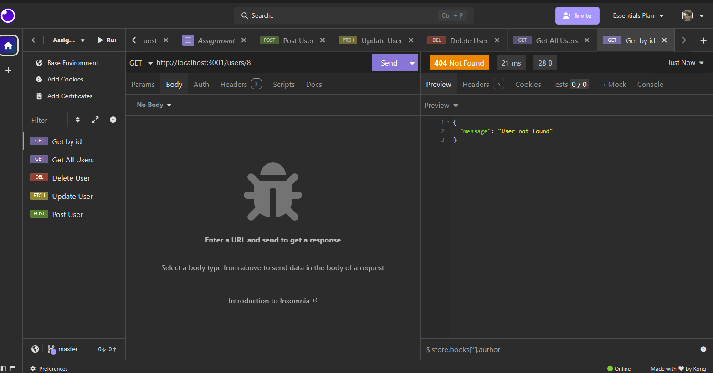
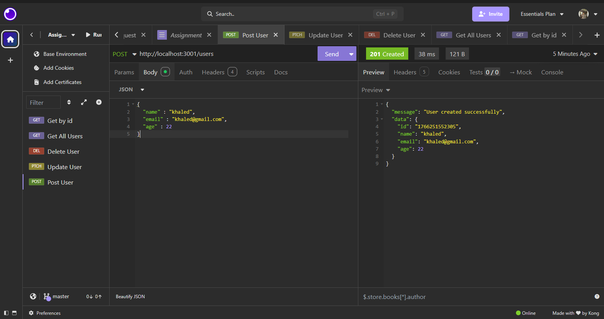
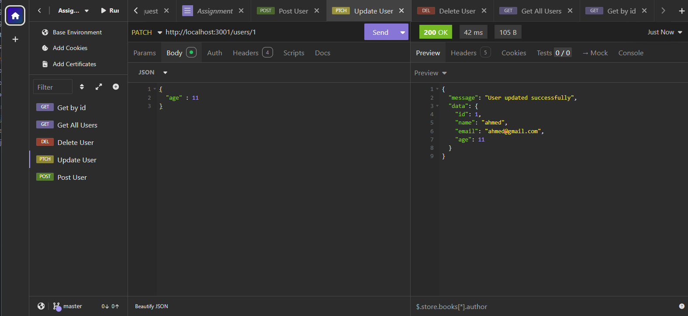
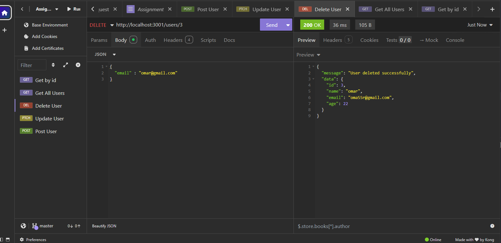

# Assignment 3

### 1 What is the Nodejs Event Loop? (05 Grade)

#### **Event Loop (The Heart of Nodejs)**

- The **Event Loop** continuously checks the Event Queue
- If the queue is not empty, it picks a request and processes it
- _The event loop is the core of Nodejs’s asynchronous, non-blocking architecture, allowing it to handle many tasks efficiently without multiple threads_

### 2 What is Libuv and What Role Does It Play in Nodejs? (05 Grade)

- Libuv is a **C library** that Nodejs uses under the hood to handle asynchronous I/O operations

### 3 How Does Nodejs Handle Asynchronous Operations Under the Hood? (05 Grade)

- Nodejs handles asynchronous operations by delegating them to **Libuv**, which executes them in the background and uses the **Event Loop** to run the callback when ready, enabling non-blocking behavior

### 4 What is the Difference Between the Call Stack, Event Queue, and Event Loop in Nodejs? (05 Grade)

- **Call Stack**: Where synchronous JavaScript code is executed, one function at a time
- **Event Queue** (or Callback Queue): Holds callbacks from asynchronous operations waiting to be executed
- **Event Loop:** Continuously checks the Call Stack and Event Queue, moving callbacks from the queue to the stack when it’s empty, enabling non-blocking execution

### 5 What is the Nodejs Thread Pool and How to Set the Thread Pool Size? (05 Grade)

- Nodejs Thread Pool is a pool of threads managed by Libuv used to handle asynchronous operations like file system, DNS, or crypto tasks that cannot be performed non-blocking
- Purpose: Offload heavy I/O tasks from the single main thread to avoid blocking
- Default Size: 4 threads
- How to set size:

```bash
export UV_THREADPOOL_SIZE=8   # Linux/macOS
set UV_THREADPOOL_SIZE=8      # Windows
```

- This sets the number of threads in the pool (max 128)

### 6 How Does Nodejs Handle Blocking and Non-Blocking Code Execution? (05 Grade)

- **Blocking code** runs on the main thread and stops execution until it finishes (eg, fsreadFileSync)
- **Non-blocking code** is handled asynchronously by Libuv; the operation runs in the background, and its callback is executed later via the Event Loop, allowing the main thread to continue

### Result OF CRUD

1. Get All Users


2. Get User By ID

- Found
  - 
- not found
  - 

3. POST User



4. PATCH



5. Delete


