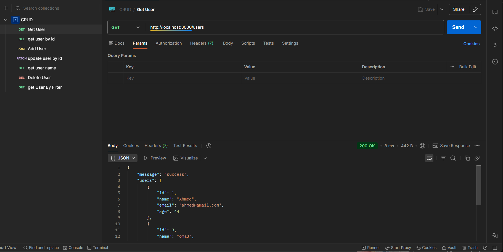
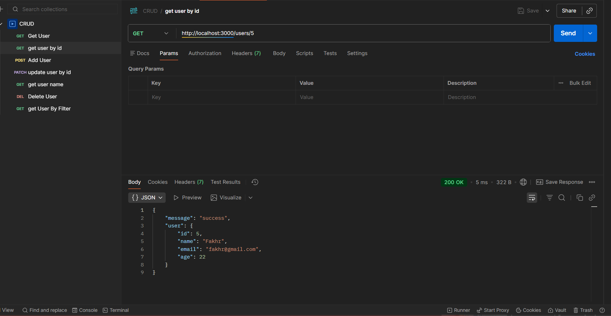
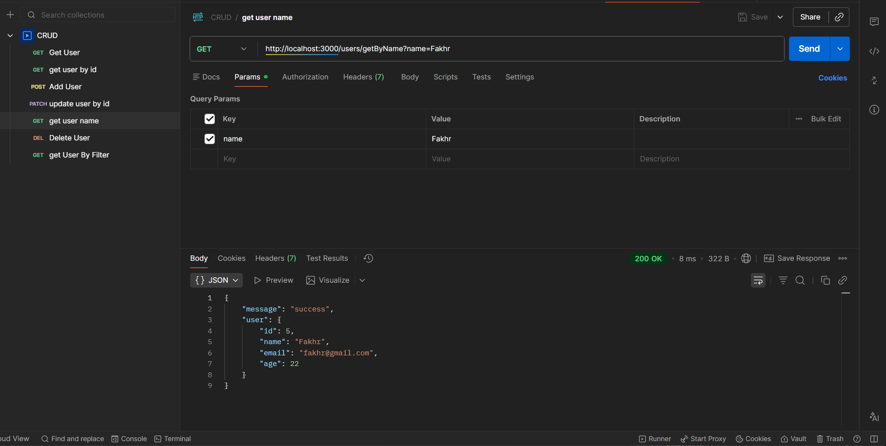
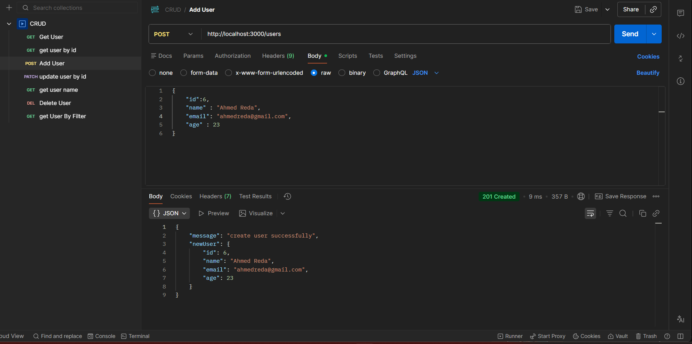
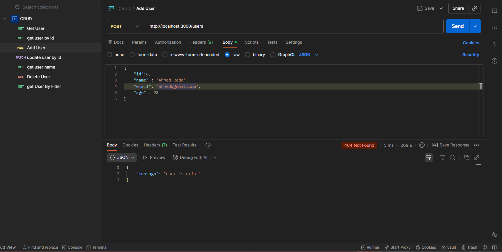
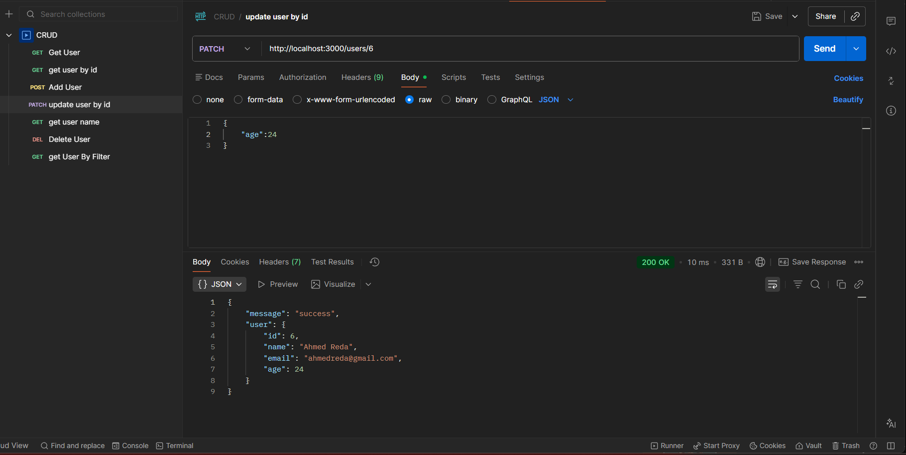
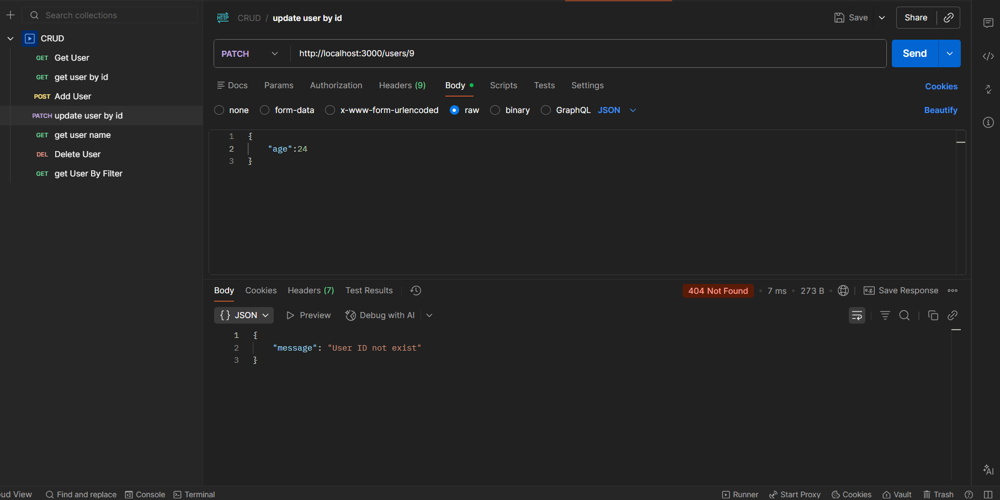
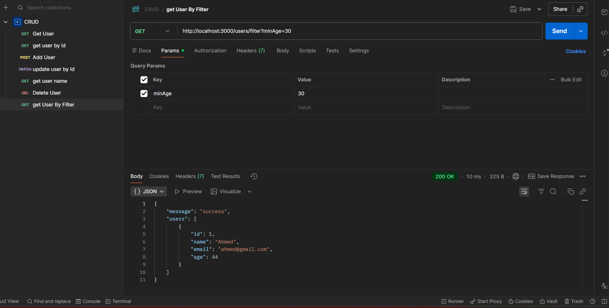
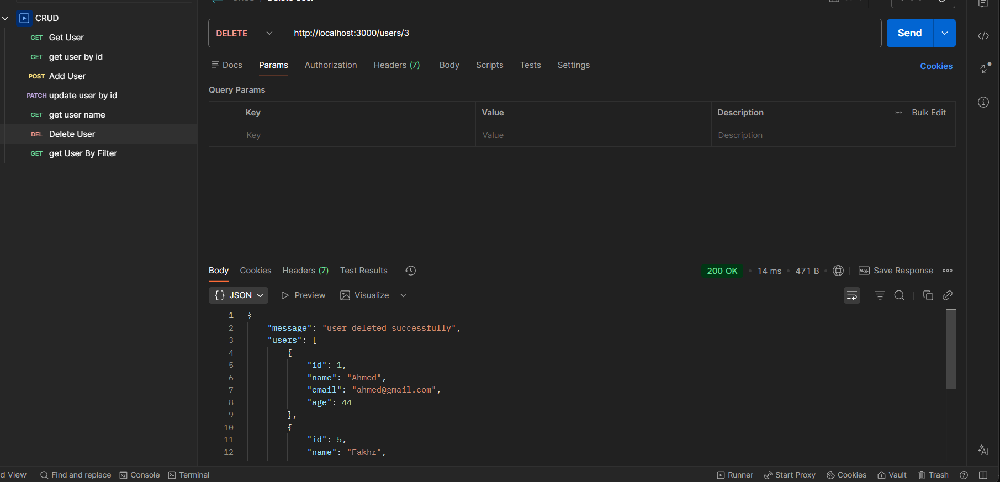
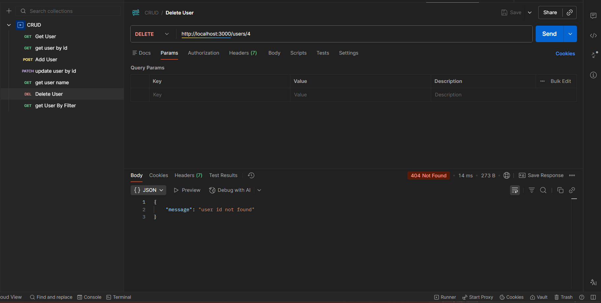

# Assignment Express And ERD

### Let's go to show output of CRUD First

##### Get All Users

##### Get User By ID

- 

- 

##### Get User By Name

##### Post User

- 
- 

##### Patch User

- 
- 

##### Filter By Age

##### Delete

- 
- 

### ERD

